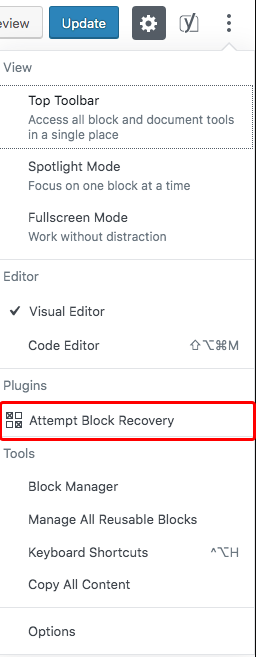

# A plugin that adds a button to Gutenberg (wordpress) to recover the broken blocks

## How to use:
* Go to the top right corner and click on the three points menu icon
* Click on "Attempt Block Recovery" (marked in red in the image below)

## Changelog
###v1.0.0
